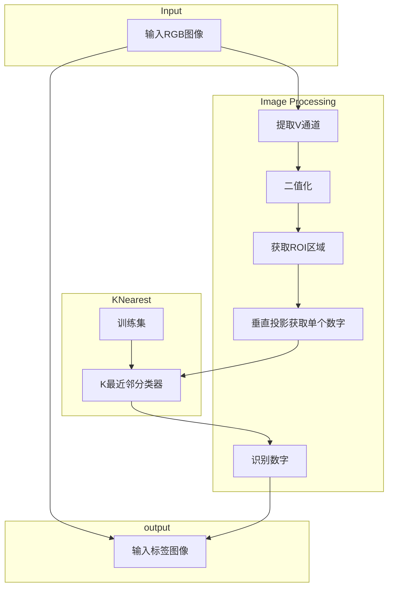

# Digital-Meter-Identification
数字电表识别(传统方法)

## 算法流程

```mermaid

graph TD

subgraph Input
	A[输入RGB图像]
end

subgraph Image Processing
	B[提取V通道]
	C[二值化]
	D[获取ROI区域]
	E[垂直投影获取单个数字]
	F[识别数字]
end

subgraph KNearest
	X[训练集]
	K[K最近邻分类器]
end


subgraph output
	O[输入标签图像]
end

	A-->B
	B-->C-->D-->E
	E-->K-->F
	A-->O
	F-->O
	X-->K
```

## 结果展示

  

