<h1 align="center">Welcome to Digital-Meter-Identification 👋</h1>

   
  
  
  

> 数字电表识别(传统方式)

## 算法流程

```mermaid

graph TD

subgraph Input
	A[输入RGB图像]
end

subgraph Image Processing
	B[提取V通道]
	C[二值化]
	D[获取ROI区域]
	E[垂直投影获取单个数字]
	F[识别数字]
end

subgraph KNearest
	X[训练集]
	K[K最近邻分类器]
end


subgraph output
	O[输入标签图像]
end

	A-->B
	B-->C-->D-->E
	E-->K-->F
	A-->O
	F-->O
	X-->K
```

## 识别结果

  

## Author

👤 **yunke120**

* Website: https://yunke120.gitee.io/
* Github: [@yunke120](https://github.com/yunke120)

## 🤝 Contributing

Contributions, issues and feature requests are welcome! Feel free to check [issues page](https://github.com/yunke120/Digital-Meter-Identification/issues). You can also take a look at the [contributing guide](https://github.com/yunke120/Digital-Meter-Identification/blob/master/CONTRIBUTING.md).

## Show your support

Give a ⭐️ if this project helped you!

## 📝 License

Copyright © 2023 [yunke120](https://github.com/yunke120). 
This project is [Apache 2.0](https://github.com/yunke120/Digital-Meter-Identification/blob/master/LICENSE) licensed.
